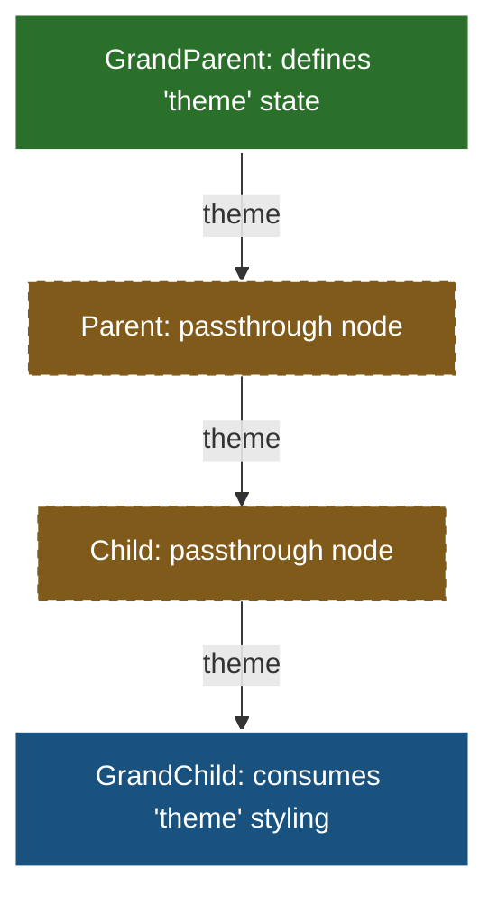
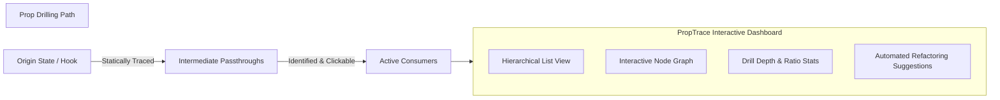

# PropTrace VS Code Extension

**PropTrace** is a static analysis and interactive visualization tool for React, React Native, and Next.js developers. It helps you analyze, untangle, and optimize complex prop-drilling pathways.

---

## 1. The Problem Statement: What is Prop Drilling?

In React, data is passed top-down via props. As applications scale, you often need to share state between a deeply nested component and a high-level parent. 

This leads to **Prop Drilling**—the practice of passing props through intermediate components that do not need the data themselves, just to reach a child component.



### Why is this bad?
* **High Coupling**: Intermediate components become tightly coupled to data they don't even use. Renaming a prop requires refactoring every file in the chain.
* **Code Clutter**: Component parameter lists grow bloated, making code harder to read and maintain.
* **Performance Impact**: Large component trees re-render unnecessarily as properties change along the chain.

---

## 2. The Solution: PropTrace

PropTrace solves this by statically tracing the flow of any React prop in your codebase. It builds a complete path graph, allowing you to instantly visualize where a prop came from, where it goes, and whether it represents an architectural code smell.



With PropTrace, you get:
* **Interactive Visualization**: Toggle between hierarchical Tree lists and automated, animated level-based Node Graphs (powered by `reactflow`).
* **Smell Identification**: Analyzes metrics like **Drill Depth**, **Passthrough Count**, and **Passthrough Ratio** to score the health of your props.
* **Automated Refactoring Recommendations**: Direct tips on when to extract a custom hook, use React Context/Composition, or apply state management tools.
* **One-Click Navigation**: Clicking on any component card instantly focuses and jumps your VS Code editor cursor to the exact line where the prop is used.

---

## 3. How to Install & Launch PropTrace

### Requirements
- Node.js `^20.x` or newer
- VS Code `^1.85.0` or newer

### Setup
1. Clone this repository and open the workspace in VS Code.
2. Install the necessary packages:
   ```bash
   npm install
   ```
3. Compile the extension and the visualizer dashboard bundle:
   ```bash
   npm run build
   ```

### Running the Extension in VS Code
To run and test the extension interactively:
1. Open the **Run and Debug** view in your VS Code Sidebar (or press `Ctrl+Shift+D` / `Cmd+Shift+D`).
2. Select **"Run Extension"** from the drop-down menu at the top.
3. Click the green **Play** button (or press **`F5`**).
4. A new window (the *Extension Development Host*) will open with the PropTrace extension activated.

---

## 4. How to Use the Visualizer (Step-by-Step)

Once the new VS Code window is open:

### 1. Open a React Project
Open a workspace directory containing React/JSX components (for testing, you can open the `C:\Users\darkt\OneDrive\Documents\Desktop\proptrace-sdk` folder itself to test on our pre-loaded fixtures in `test-fixtures/`).

### 2. Trigger a Prop Trace
You can trace a prop in two convenient ways:
* **CodeLens (One-Click)**: Find any React component definition. You will see a small inline line above it: `🔍 Trace props (title)`. Click it.
* **Context Menu**: Highlight or put your editor cursor on any prop identifier inside a component, right-click, and select **"PropTrace: Trace Prop"**.

### 3. Interacting with the Dashboard
The PropTrace panel will appear on the right side:
* **Toggle Views**: Switch between the **Tree View** (clean hierarchical indented listing) and the **Graph View** (animated flow graph where you can pan/zoom).
* **Code Jumps**: Click on any node box to automatically navigate your editor view to that file's line and column.
* **Analyze Metrics**: Look at the sidebar to review the **Drill Depth** and **Passthrough Ratio** progress bar.
* **Refactor suggestions**: Read the collapsible suggestions card outlining contextual steps to clean up the prop-drilled smells.
* **Drill Overview**: Right-click inside a React file and select **"PropTrace: Show All Drilled Props in File"** to list all props, score their drilling depth in a clean table, and trace them instantly.

---

## 5. Architecture & Codebase Layout

```
├── src/
│   ├── analyzers/                   # Metrics score & refactoring suggestions
│   │   ├── drillDepthAnalyzer.ts
│   │   └── suggestionAnalyzer.ts
│   ├── commands/                    # VS Code command registrations & CodeLens
│   │   ├── codeLensProvider.ts
│   │   ├── showAllDrilledPropsCommand.ts
│   │   └── tracePropCommand.ts      # Webview host & bridge coordinator
│   ├── trace/                       # AST Engine powered by ts-morph
│   │   ├── buildTraceGraph.ts       # Coordinate full backward + forward tracing
│   │   ├── detectPassthrough.ts     # Classify usages & spread boundaries
│   │   ├── resolvePropOrigin.ts     # Backward tracer (hooks/context/destructuring)
│   │   └── tracePropForward.ts      # Forward tracer (JSX trees)
│   ├── types/                       # Core TypeScript type definitions
│   └── webview/                     # React visualizer app
│       ├── App.tsx                  # Root dashboard (tabs/sidebars/overview tables)
│       ├── TreeView.tsx             # Interactive hierarchical list
│       ├── GraphView.tsx            # Node-link graphs (powered by reactflow)
│       └── messaging.ts             # Safe bridge for VS Code host communications
├── tests/                           # Unit tests covering the static engine
└── esbuild.config.js                # Builds extension & webview bundle
```

---

## 6. Running Tests

Execute the comprehensive engine tests using Vitest:
```bash
npm test
```
